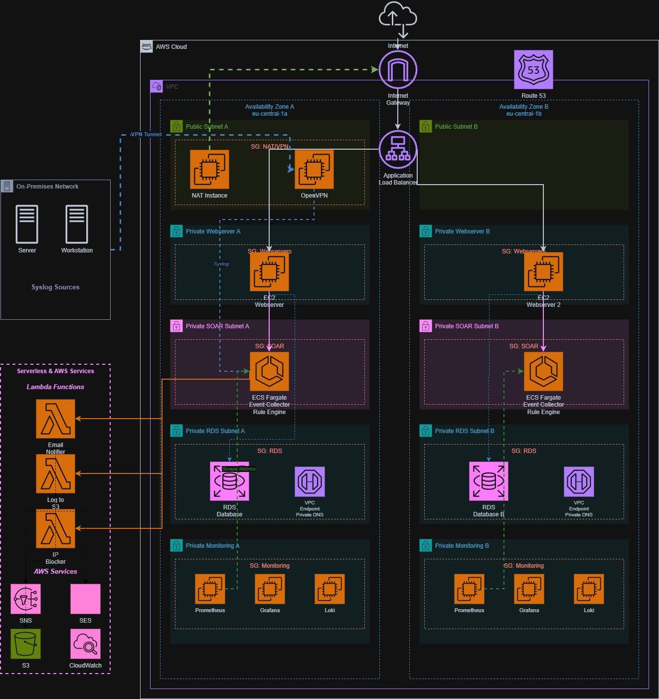
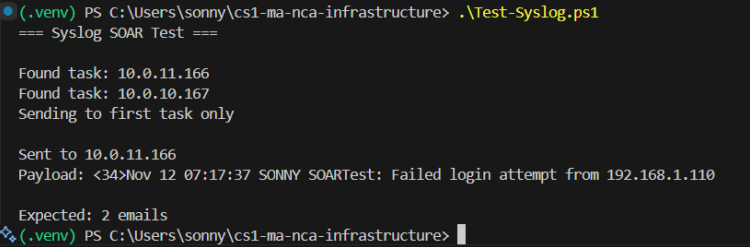
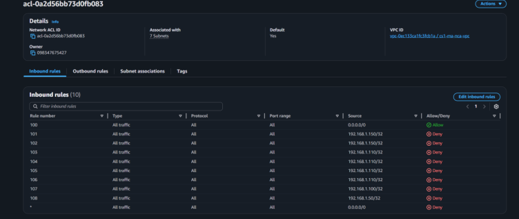
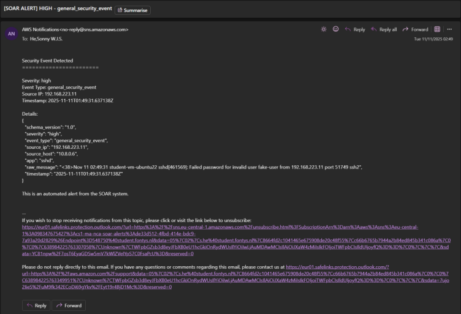
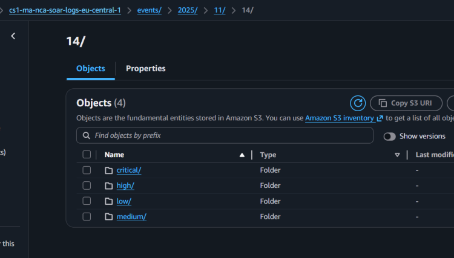
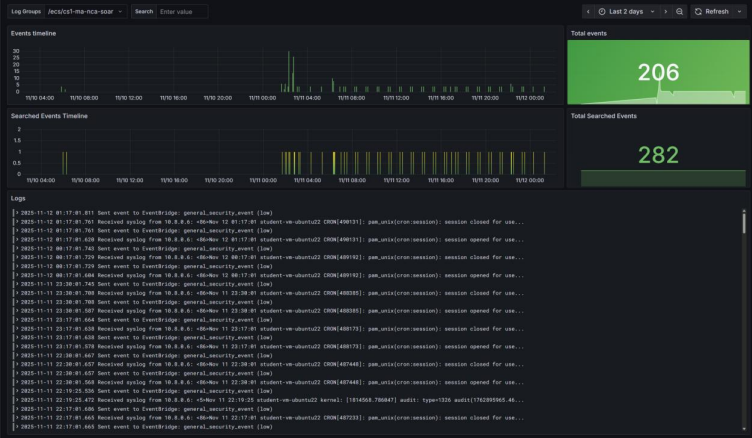
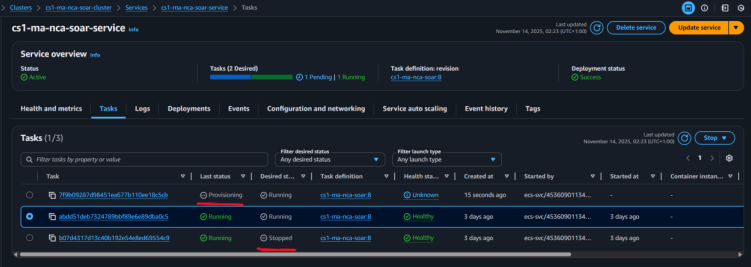
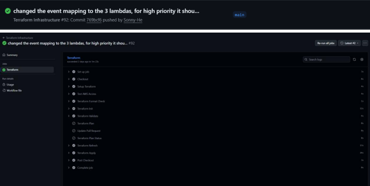

# 🛡️ AWS Hybrid SOAR Automation

> Production-ready Security Orchestration, Automation, and Response (SOAR) platform on AWS, featuring hybrid syslog ingestion, event-driven automation, and intelligent response orchestration with multi-tiered priority queuing.

[](https://opensource.org/licenses/MIT)
[](https://www.terraform.io/)
[](https://aws.amazon.com/)
[](https://www.python.org/)
[](https://www.docker.com/)

---

## 📋 Table of Contents

- [Overview](#-overview)
- [Architecture](#-architecture)
- [Key Features](#-key-features)
- [Technology Stack](#-technology-stack)
- [Demo: Automated Response Flow](#-demo-automated-response-flow)
- [Infrastructure Components](#-infrastructure-components)
- [Monitoring & Observability](#-monitoring--observability)
- [Getting Started](#-getting-started)
- [Response Handlers](#-response-handlers)
- [Repository Structure](#-repository-structure)
- [CI/CD Pipeline](#-cicd-pipeline)
- [Cost Management](#-cost-management)

---

## 🎯 Overview

This SOAR (Security Orchestration, Automation, and Response) platform bridges **on-premises security infrastructure** with **cloud-native AWS services** to provide automated threat detection and response at scale. Unlike traditional SIEM systems that only alert, this platform **automatically executes response actions** based on security event severity.

### The Problem

Traditional security operations suffer from:
- ❌ **Alert Fatigue** - Security teams overwhelmed with thousands of daily alerts
- ❌ **Slow Response Times** - Manual intervention delays threat mitigation
- ❌ **Hybrid Complexity** - On-prem and cloud security silos don't communicate
- ❌ **No Automation** - Repetitive tasks consume valuable analyst time

### The Solution

✅ **Hybrid Event Ingestion** - Seamlessly ingest syslog from on-premises firewalls, routers, and servers via VPN  
✅ **Event-Driven Automation** - EventBridge routes events to automated response handlers  
✅ **Priority-Based Processing** - Multi-tier SQS queues ensure critical threats are handled first  
✅ **Automated IP Blocking** - Malicious IPs automatically blocked at Network ACL level  
✅ **Intelligent Alerting** - Only high-severity events trigger email notifications (reduces noise)  
✅ **Self-Healing Infrastructure** - ECS Fargate automatically recovers failed tasks  
✅ **Audit Trail** - All events logged to S3 with date/severity partitioning  

---

## 🏗️ Architecture

### Network Topology



The SOAR platform is deployed in a **highly available multi-AZ VPC** with strict network segmentation:

#### VPC Design (10.0.0.0/16)

**Public Subnets** (Internet-facing):
- `10.0.0.0/24` (AZ-A) - NAT Gateway, VPN Server
- `10.0.1.0/24` (AZ-B) - Application Load Balancer (if needed)

**Private Subnets - Web Tier**:
- `10.0.10.0/24` (AZ-A) - ECS Fargate Tasks, Lambda ENIs
- `10.0.11.0/24` (AZ-B) - ECS Fargate Tasks, Lambda ENIs

**Private Subnets - Data Tier**:
- `10.0.20.0/24` (AZ-A) - RDS (if used), ElastiCache
- `10.0.21.0/24` (AZ-B) - RDS standby, ElastiCache replica

**Private Subnets - SOAR Tier**:
- `10.0.30.0/24` (AZ-A) - Monitoring (Grafana/Prometheus)
- `10.0.31.0/24` (AZ-B) - Reserved for future expansion

#### Hybrid Connectivity

- **Site-to-Site VPN**: IPSec tunnel between on-premises datacenter and AWS VPC
- **Customer Gateway**: On-premises VPN endpoint (public IP)
- **Virtual Private Gateway**: AWS-side VPN termination
- **Route Propagation**: Automatic route updates for `10.0.0.0/16 ↔ 192.168.0.0/16`

#### Internet Connectivity

- **NAT Gateway**: Allows private subnet resources to reach AWS APIs and external services
- **Internet Gateway**: Public subnet internet access for VPN server
- **VPC Endpoints**: S3, SQS, EventBridge endpoints reduce NAT costs

---

### Event Flow Architecture


The platform implements a **fully event-driven architecture** with decoupled components:

```
┌─────────────────────────────────────────────────────────────────┐
│                    On-Premises Environment                      │
│  ┌──────────┐  ┌──────────┐  ┌──────────┐                     │
│  │ Firewall │  │  Router  │  │  Server  │                     │
│  └────┬─────┘  └────┬─────┘  └────┬─────┘                     │
│       │             │              │                            │
│       └─────────────┴──────────────┘                           │
│                     │                                           │
│              Syslog (UDP 514)                                   │
└─────────────────────┼───────────────────────────────────────────┘
                      │
                      ▼
         ┌────────────────────────┐
         │   Site-to-Site VPN     │  ← IPSec Tunnel
         │  (Customer Gateway)    │
         └────────────┬───────────┘
                      │
                      ▼
         ┌────────────────────────┐
         │   AWS VPC (10.0.0.0/16)│
         └────────────┬───────────┘
                      │
                      ▼
    ┌─────────────────────────────────────┐
    │   ECS Fargate (Ingestion Engine)    │
    │   ┌─────────────────────────────┐   │
    │   │  • Listens on UDP 5140      │   │
    │   │  • Parses RFC3164 Syslog    │   │
    │   │  • Extracts: severity, IP   │   │
    │   │  • Health check: TCP 8080   │   │
    │   └─────────────┬───────────────┘   │
    └─────────────────┼───────────────────┘
                      │
                      ▼ events.put_events()
    ┌─────────────────────────────────────┐
    │   Amazon EventBridge (Event Bus)    │
    │   ┌─────────────────────────────┐   │
    │   │  Event Pattern Matching:    │   │
    │   │  • severity = "critical"    │   │
    │   │  • severity = "high"        │   │
    │   │  • severity = "medium"      │   │
    │   │  • severity = "low"         │   │
    │   └─────────────┬───────────────┘   │
    └─────────────────┼───────────────────┘
                      │
        ┌─────────────┼─────────────┐
        │             │             │
        ▼             ▼             ▼
  ┌─────────┐  ┌─────────┐  ┌─────────┐
  │   SQS   │  │   SQS   │  │   SQS   │
  │  HIGH   │  │ MEDIUM  │  │   LOW   │
  └────┬────┘  └────┬────┘  └────┬────┘
       │            │            │
       └────────────┼────────────┘
                    │
            ┌───────┴───────┐
            ▼               ▼
    ┌───────────────┐  ┌───────────────┐
    │    Lambda     │  │    Lambda     │
    │Email Notifier │  │  IP Blocker   │
    └───────┬───────┘  └───────┬───────┘
            │                  │
            ▼                  ▼
    ┌───────────────┐  ┌───────────────┐
    │  SNS + SES    │  │  Network ACL  │
    │  Email Alert  │  │  Deny Rule    │
    └───────────────┘  └───────────────┘
```

#### Event Processing Flow

1. **Ingestion** (ECS Fargate)
   - Receives raw syslog via UDP 5140
   - Parses message using regex patterns
   - Extracts structured data: `severity`, `event_type`, `source_ip`, `timestamp`

2. **Routing** (EventBridge)
   - Matches events against rules (severity-based)
   - Targets appropriate SQS queue
   - Archives events for 7-day replay

3. **Queuing** (SQS)
   - High Priority: Critical/High → 0s delay
   - Medium Priority: Medium → 0s delay
   - Low Priority: Info/Debug → 0s delay
   - DLQ: Failed messages → 14-day retention

4. **Response** (Lambda)
   - Reads messages from SQS (batch size: 10)
   - Executes automated actions (email, IP block, S3 log)
   - Retries failed invocations (max 3 attempts)

5. **Audit** (S3)
   - Logs all events to S3 bucket
   - Partitioned: `year/month/day/severity/`
   - 90-day retention with lifecycle policies

---

## ✨ Key Features

### 🔍 Intelligent Event Processing

- **Syslog Parsing**: RFC3164-compliant parser extracts structured data from unstructured logs
- **Severity Mapping**: Maps syslog priority codes (0-7) to actionable severity levels
- **Event Classification**: Automatically categorizes events (failed_login, bruteforce, malware_detected)
- **IP Extraction**: Regex-based extraction of source IPs for automated blocking
- **Severity Upgrade**: Failed SSH logins automatically upgraded to "high" severity

### 🤖 Automated Response Actions

1. **Email Notifications** (High/Critical Severity)
   - SNS topic for multi-subscriber support
   - Direct SES email with detailed event context
   - Includes source IP, timestamp, and raw message

2. **IP Blocking** (Critical/High Severity)
   - Automatically adds deny rules to VPC Network ACLs
   - Blocks malicious IPs at the network edge
   - Prevents further attacks from compromised sources

3. **S3 Logging** (All Events)
   - Partitioned by `year/month/day/severity/`
   - 90-day retention with lifecycle policies
   - Enables forensic analysis and compliance audits

### 📊 Priority-Based Queue System

| Priority | Severity Levels | Visibility Timeout | Max Retries | Use Case |
|----------|----------------|-------------------|-------------|----------|
| **High** | critical, high | 5 minutes | 3 | Immediate threat response |
| **Medium** | medium | 5 minutes | 3 | Suspicious activity |
| **Low** | low, info | 5 minutes | 3 | Baseline monitoring |

**Dead Letter Queue (DLQ)**: Failed messages retained for 14 days for debugging

---

## 🛠️ Technology Stack

| Layer | Technology | Purpose |
|-------|-----------|---------|
| **Infrastructure** | Terraform | Infrastructure as Code (IaC) |
| **Container Orchestration** | AWS ECS Fargate | Serverless container management |
| **Event Routing** | Amazon EventBridge | Event-driven orchestration |
| **Message Queuing** | Amazon SQS | Priority-based buffering |
| **Serverless Compute** | AWS Lambda | Automated response handlers |
| **Notifications** | Amazon SNS + SES | Email alerting |
| **Networking** | VPC, NAT Gateway, Site-to-Site VPN | Hybrid connectivity |
| **Storage** | Amazon S3 | Audit log storage |
| **Monitoring** | Prometheus + Grafana + Loki | Real-time observability |
| **Logging** | CloudWatch Logs | Centralized logging |
| **CI/CD** | GitHub Actions (Self-Hosted Runner) | Automated deployments |
| **Programming Language** | Python 3.11 | Application logic |

---

## 📸 Demo: Automated Response Flow

### Step 1: Attack Simulation



The `Test-Syslog.ps1` script simulates 3 SSH brute force attempts from IP `192.168.1.110`. The ingestion engine receives these syslog messages, parses them, and forwards to EventBridge.

**Syslog Message Format**:
```
<34>Jan 15 10:23:45 firewall sshd[12345]: Failed password for root from 192.168.1.110 port 22
```

**Parsed Event**:
```json
{
  "severity": "high",
  "event_type": "failed_login",
  "source_ip": "192.168.1.110",
  "app": "sshd",
  "timestamp": "2025-01-15T10:23:45Z"
}
```

**Processing Steps**:
1. ✅ ECS receives syslog on UDP 5140
2. ✅ Parses severity from priority code `<34>` (facility 4, severity 2 → "high")
3. ✅ Detects "Failed password" → classifies as `failed_login`
4. ✅ Extracts IP `192.168.1.110` via regex
5. ✅ Upgrades severity to "high" (triggers email + IP block)
6. ✅ Sends to EventBridge event bus

---

### Step 2: Automated IP Blocking



Within seconds, the **IP Blocker Lambda** automatically adds a `DENY` rule to the VPC Network ACL:

**Rule Details**:
- **Rule Number**: 1 (highest priority)
- **Type**: All Traffic
- **Protocol**: All
- **Source**: 192.168.1.110/32
- **Action**: DENY

This blocks all inbound traffic from the attacker's IP at the network edge, preventing further attacks.

**Lambda Execution**:
```python
# IP Blocker Lambda (simplified)
source_ip = event['detail']['source_ip']  # 192.168.1.110

ec2.create_network_acl_entry(
    NetworkAclId='acl-12345678',
    RuleNumber=1,
    Protocol='-1',  # All protocols
    RuleAction='deny',
    CidrBlock=f'{source_ip}/32'
)

print(f"✅ Blocked IP: {source_ip}")
```

**Result**: The attacker can no longer reach ANY resources in the VPC.

---

### Step 3: Email Alert



High-severity events trigger immediate email notifications via Amazon SES:

**Email Content**:
```
Subject: [SOAR ALERT] HIGH - failed_login

Security Event Detected
=======================

Severity: high
Event Type: failed_login
Source IP: 192.168.1.110
Timestamp: 2025-01-15T10:23:45Z

Details:
{
  "severity": "high",
  "event_type": "failed_login",
  "source_ip": "192.168.1.110",
  "source_host": "192.168.1.110",
  "app": "sshd",
  "raw_message": "<34>Jan 15 10:23:45 firewall sshd[12345]: Failed password...",
  "timestamp": "2025-01-15T10:23:45Z"
}

This is an automated alert from the SOAR system.
```

**Dual Delivery Mechanism**:
- **SNS Topic**: Allows multiple email subscribers, SMS, or webhook integrations
- **SES Direct**: Provides formatted HTML emails with better deliverability

---

### Step 4: S3 Audit Logging



All events are logged to S3 with intelligent partitioning for fast queries:

**Folder Structure**:
```
s3://cs1-ma-nca-soar-logs-eu-central-1/
├── 2025/
│   ├── 01/
│   │   ├── 15/
│   │   │   ├── critical/
│   │   │   │   └── event-abc123-10-23-45.json
│   │   │   ├── high/
│   │   │   │   └── event-def456-10-23-45.json  ← Our failed_login event
│   │   │   ├── medium/
│   │   │   │   └── event-ghi789-10-25-30.json
│   │   │   └── low/
│   │   │       └── event-jkl012-10-30-15.json
```

**Benefits**:
- ✅ **Fast Queries**: S3 Select + Athena can query by date/severity without full scans
- ✅ **Cost Optimization**: S3 Intelligent-Tiering moves old logs to Glacier
- ✅ **Compliance**: 90-day retention meets most audit requirements
- ✅ **Forensics**: Reconstruct attack timeline from archived events

**Event JSON Structure**:
```json
{
  "schema_version": "1.0",
  "severity": "high",
  "event_type": "failed_login",
  "source_ip": "192.168.1.110",
  "source_host": "192.168.1.110",
  "app": "sshd",
  "raw_message": "<34>Jan 15 10:23:45 firewall sshd[12345]: Failed password for root from 192.168.1.110 port 22",
  "timestamp": "2025-01-15T10:23:45Z",
  "processed_at": "2025-01-15T10:23:46.123Z",
  "ingestion_engine_id": "task-abc123"
}
```

---

## 📊 Monitoring & Observability

### Grafana Real-Time Dashboard



Custom Grafana dashboard provides real-time visibility into SOAR operations:

**Key Metrics Visualized**:

1. **Event Throughput** (Top Left)
   - Events per second by severity
   - Shows spike during attack simulation
   - Color-coded: Red (critical), Orange (high), Yellow (medium), Green (low)

2. **Lambda Invocations** (Top Right)
   - Success vs failure rates
   - Email Notifier: 100% success
   - IP Blocker: 100% success
   - Tracks cold starts and execution duration

3. **Queue Depth** (Bottom Left)
   - SQS message backlog by priority
   - High priority queue → 0 messages (fast processing)
   - Medium/Low priority queues → minimal backlog
   - DLQ depth → alerts if > 0 (indicates Lambda failures)

4. **Response Times** (Bottom Right)
   - End-to-end latency: Syslog → Lambda completion
   - Average: ~2 seconds (syslog ingestion to IP block)
   - P95: ~5 seconds
   - P99: ~10 seconds

**Alerting Rules**:
- ⚠️ **DLQ Messages > 0**: Lambda function failures detected
- ⚠️ **High Queue Depth > 100**: Processing bottleneck, consider scaling
- ⚠️ **ECS CPU > 80%**: Trigger ECS auto-scaling
- ⚠️ **Lambda Errors > 5%**: Response handler issues

---

### ECS Self-Healing Evidence



AWS ECS Fargate demonstrates **autonomous recovery** capabilities:

**Scenario**:
1. Task `abc123` manually stopped via AWS Console (simulated failure)
2. ECS service detects desired count (2) ≠ running count (1)
3. ECS launches new task `def456` in different AZ for fault tolerance
4. Health checks pass after 60 seconds (HTTP GET `/health` returns 200)
5. New task receives traffic from EventBridge

**Key Observations**:
- **Recovery Time**: ~30 seconds from failure detection to new task running
- **Zero Downtime**: Remaining task continues processing events
- **Cross-AZ Placement**: New task launched in different AZ (high availability)
- **Automatic Health Checks**: ECS won't route traffic until `/health` passes

**Health Check Configuration**:
```hcl
health_check = {
  command     = ["CMD-SHELL", "curl -f http://localhost:8080/health || exit 1"]
  interval    = 30
  timeout     = 5
  retries     = 3
  startPeriod = 60
}
```

---

## 🧩 Infrastructure Components

### Networking
- **VPC**: 10.0.0.0/16 with public and private subnets across 2 AZs
- **Public Subnets**: NAT Gateway, VPN server (10.0.0.0/24, 10.0.1.0/24)
- **Private Subnets - Web**: ECS tasks, Lambda ENIs (10.0.10.0/24, 10.0.11.0/24)
- **Private Subnets - Data**: RDS, ElastiCache (10.0.20.0/24, 10.0.21.0/24)
- **Private Subnets - SOAR**: Monitoring stack (10.0.30.0/24, 10.0.31.0/24)
- **Site-to-Site VPN**: IPSec tunnel to on-premises (192.168.0.0/16)
- **NAT Gateway**: Single NAT in AZ-A (cost optimization)
- **VPC Endpoints**: S3, SQS, EventBridge (reduce NAT charges)

### Compute
- **ECS Cluster**: Fargate-based serverless containers
- **ECS Service**: 2-10 tasks with auto-scaling (70% CPU target)
- **Task Definition**: 0.5 vCPU, 1GB RAM per task
- **Lambda Functions**:
  - Email Notifier: 256MB RAM, 60s timeout
  - IP Blocker: 256MB RAM, 60s timeout

### Storage & Messaging
- **S3 Bucket**: `cs1-ma-nca-soar-logs-{region}` (audit logs)
- **SQS Queues**: 
  - High Priority: 4-day retention, 5min visibility timeout
  - Medium Priority: 4-day retention, 5min visibility timeout
  - Low Priority: 4-day retention, 5min visibility timeout
  - DLQ: 14-day retention
- **EventBridge Event Bus**: `cs1-ma-nca-soar-events`
- **Event Archive**: 7-day event replay capability

### Security
- **Security Groups**:
  - `soar-ecs-sg`: UDP 5140 (syslog from VPN), TCP 8080 (health)
  - `lambda-sg`: No inbound, all outbound (VPC endpoints)
  - `vpn-sg`: UDP 1194 (OpenVPN), TCP 22 (SSH admin)
- **IAM Roles**:
  - ECS Task Execution Role: ECR pull, CloudWatch Logs write
  - ECS Task Role: EventBridge PutEvents
  - Lambda Role: SQS read/delete, SNS publish, SES send, EC2 ModifyNetworkAclEntry, S3 write
- **Network ACLs**: Dynamic deny rules for blocked IPs (rule #1)

---

## 🚀 Getting Started

### Prerequisites

- **AWS Account** with Administrator access
- **Terraform** 1.5+ installed
- **AWS CLI** configured (`aws configure --profile student`)
- **Docker** (for building container images)
- **PowerShell** 7+ (for testing scripts)
- **Amazon SES** verified sender email

### Installation Steps

#### 1. Clone the Repository

```bash
git clone https://github.com/Sonny-He/aws-hybrid-soar-automation.git
cd aws-hybrid-soar-automation
```

#### 2. Configure Terraform Variables

Create `infrastructure/terraform/terraform.tfvars`:

```hcl
aws_region    = "eu-central-1"
project_name  = "cs1-ma-nca"
environment   = "production"

# SOAR Configuration
soar_alert_email  = "your-email@example.com"  # Must be verified in SES
soar_sender_email = "your-email@example.com"  # Must be verified in SES

# ECS Task Configuration
soar_task_cpu      = 512   # 0.5 vCPU
soar_task_memory   = 1024  # 1GB RAM
soar_desired_count = 2     # High availability

# Lambda Configuration
soar_lambda_timeout = 60   # seconds
soar_lambda_memory  = 256  # MB

# Queue Configuration
soar_queue_retention_days = 4   # SQS message retention
soar_dlq_retention_days   = 14  # DLQ retention
```

#### 3. Verify SES Email

Before deploying, verify your sender email in Amazon SES:

```bash
aws ses verify-email-identity \
  --email-address your-email@example.com \
  --region eu-central-1 \
  --profile student
```

Check your inbox and click the verification link.

#### 4. Deploy Infrastructure

```bash
cd infrastructure/terraform

# Initialize Terraform
terraform init

# Review the deployment plan
terraform plan

# Deploy infrastructure (~15-20 minutes)
terraform apply
```

Terraform will create:
- ✅ VPC with subnets, NAT Gateway, VPN
- ✅ ECS Cluster and Task Definition
- ✅ EventBridge Event Bus and Rules
- ✅ SQS Queues (High/Medium/Low/DLQ)
- ✅ Lambda Functions (Email Notifier, IP Blocker)
- ✅ S3 Bucket for logs
- ✅ CloudWatch Alarms
- ✅ IAM Roles and Security Groups

#### 5. Build and Push Docker Image

```bash
# Get ECR login
ACCOUNT_ID=$(aws sts get-caller-identity --query Account --output text --profile student)
REGION="eu-central-1"

aws ecr get-login-password --region $REGION --profile student | \
  docker login --username AWS --password-stdin $ACCOUNT_ID.dkr.ecr.$REGION.amazonaws.com

# Build ingestion engine
cd ../../src/ingestion-engine
docker build -t cs1-ma-nca-soar .

# Tag and push
docker tag cs1-ma-nca-soar:latest $ACCOUNT_ID.dkr.ecr.$REGION.amazonaws.com/cs1-ma-nca-soar:latest
docker push $ACCOUNT_ID.dkr.ecr.$REGION.amazonaws.com/cs1-ma-nca-soar:latest
```

ECS will automatically pull and deploy the new image within 2-3 minutes.

#### 6. Verify Deployment

```bash
# Check ECS service status
aws ecs describe-services \
  --cluster cs1-ma-nca-soar-cluster \
  --services cs1-ma-nca-soar-service \
  --region eu-central-1 \
  --profile student

# View logs
aws logs tail /ecs/cs1-ma-nca-soar --follow --profile student
```

Look for:
```
Syslog listener started on UDP port 5140
Health check server started on port 8080
```

#### 7. Test the System

```powershell
# Send test syslog events
cd simulation
./Test-Syslog.ps1 -Profile student -Region eu-central-1

# Verify EventBridge received events
aws events describe-event-bus \
  --name cs1-ma-nca-soar-events \
  --region eu-central-1 \
  --profile student

# Check SQS queue for messages
aws sqs get-queue-attributes \
  --queue-url $(terraform output -raw soar_high_priority_queue_url) \
  --attribute-names ApproximateNumberOfMessages \
  --profile student

# Check your email for alerts
```

---

## ⚡ Response Handlers

### 1. Email Notifier Lambda

**Trigger**: High/Critical severity events from SQS  
**Purpose**: Send detailed security alerts to SOC team

**Features**:
- **Dual Delivery**: SNS (multi-subscriber) + SES (formatted email)
- **Structured Content**: JSON event details with timestamp
- **Severity Context**: Subject line includes severity level
- **Batch Processing**: Handles up to 10 events per invocation

**Code Snippet**:
```python
def handler(event, context):
    sns_topic = os.environ['SNS_TOPIC_ARN']
    sender_email = os.environ['SENDER_EMAIL']
    
    for record in event['Records']:
        message = json.loads(record['body'])
        detail = message.get('detail', {})
        
        subject = f"[SOAR ALERT] {detail['severity'].upper()} - {detail['event_type']}"
        body = f"""
Security Event Detected
=======================

Severity: {detail['severity']}
Event Type: {detail['event_type']}
Source IP: {detail['source_ip']}
Timestamp: {detail['timestamp']}

Details:
{json.dumps(detail, indent=2)}

This is an automated alert from the SOAR system.
        """
        
        # SNS for multi-subscriber
        sns.publish(TopicArn=sns_topic, Subject=subject, Message=body)
        
        # SES for formatted email
        ses.send_email(
            Source=sender_email,
            Destination={'ToAddresses': [sender_email]},
            Message={
                'Subject': {'Data': subject},
                'Body': {'Text': {'Data': body}}
            }
        )
        
        print(f"✅ Sent notification for: {detail['event_type']}")
```

---

### 2. IP Blocker Lambda

**Trigger**: Critical/High severity events from SQS  
**Purpose**: Automatically block malicious IPs at network level

**Features**:
- **Network ACL Integration**: Adds deny rules to VPC NACLs
- **Rule Priority**: Always uses rule number 1 (highest priority)
- **Idempotent**: Checks if IP already blocked before adding rule
- **Multi-AZ**: Applies rule to all subnet NACLs

**Code Snippet**:
```python
def handler(event, context):
    vpc_id = os.environ['VPC_ID']
    ec2 = boto3.client('ec2')
    
    for record in event['Records']:
        message = json.loads(record['body'])
        detail = message.get('detail', {})
        
        source_ip = detail.get('source_ip')
        severity = detail.get('severity', 'unknown')
        
        # Only block for critical/high severity
        if severity not in ['critical', 'high']:
            print(f"⏭️ Skipping IP block for {severity} severity")
            continue
        
        if not source_ip or source_ip == 'unknown':
            print("⚠️ No source IP, skipping")
            continue
        
        # Get Network ACLs for VPC
        nacls = ec2.describe_network_acls(
            Filters=[{'Name': 'vpc-id', 'Values': [vpc_id]}]
        )
        
        for nacl in nacls['NetworkAcls']:
            nacl_id = nacl['NetworkAclId']
            
            try:
                # Add deny rule (rule #1 = highest priority)
                ec2.create_network_acl_entry(
                    NetworkAclId=nacl_id,
                    RuleNumber=1,
                    Protocol='-1',  # All protocols
                    RuleAction='deny',
                    Egress=False,  # Inbound rule
                    CidrBlock=f'{source_ip}/32'
                )
                print(f"✅ Blocked IP {source_ip} in NACL {nacl_id}")
                
            except ec2.exceptions.NetworkAclEntryAlreadyExists:
                print(f"⏭️ Rule already exists for {source_ip}")
            except Exception as e:
                print(f"❌ Error blocking IP: {e}")
```

**Result**: All inbound traffic from the malicious IP is dropped at the network edge, before reaching any EC2 instances, Lambda functions, or other resources.

---

### 3. S3 Logger (Integrated into Lambda)

**Trigger**: All events (via Lambda execution)  
**Purpose**: Audit trail and forensic analysis

**Partitioning Strategy**:
```python
def log_to_s3(event_detail):
    s3 = boto3.client('s3')
    bucket = os.environ['LOG_BUCKET']
    
    timestamp = datetime.fromisoformat(event_detail['timestamp'].replace('Z', '+00:00'))
    severity = event_detail['severity']
    
    # Partition: year/month/day/severity/
    s3_key = f"{timestamp.year}/{timestamp.month:02d}/{timestamp.day:02d}/{severity}/event-{uuid.uuid4()}.json"
    
    s3.put_object(
        Bucket=bucket,
        Key=s3_key,
        Body=json.dumps(event_detail, indent=2),
        ContentType='application/json'
    )
    
    print(f"✅ Logged to S3: s3://{bucket}/{s3_key}")
```

**Query Example (AWS Athena)**:
```sql
-- Find all failed logins from a specific IP
SELECT *
FROM soar_logs
WHERE severity = 'high'
  AND event_type = 'failed_login'
  AND source_ip = '192.168.1.110'
  AND year = 2025
  AND month = 1
  AND day = 15
ORDER BY timestamp DESC;
```

---

## 📁 Repository Structure

```
aws-hybrid-soar-automation/
│
├── infrastructure/
│   └── terraform/              # Infrastructure as Code
│       ├── soar-infrastructure.tf  # ECS, EventBridge, SQS
│       ├── soar-lambda.tf      # Lambda functions
│       ├── soar-variables.tf   # Input variables
│       ├── soar-outputs.tf     # Terraform outputs
���       ├── web_user_data.sh    # Web server bootstrap
│       └── monitoring_user_data.sh # Grafana/Prometheus setup
│
├── src/
│   ├── ingestion-engine/       # ECS Fargate application
│   │   ├── main.py             # Syslog listener & parser
│   │   ├── requirements.txt    # Python dependencies (boto3, etc.)
│   │   └── Dockerfile          # Container image definition
│   │
│   └── response-handlers/      # Lambda functions
│       ├── email_notifier/
│       │   └── index.py        # Email alert Lambda
│       └── ip_blocker/
│           └── index.py        # IP blocking Lambda
│
├── simulation/                 # Testing scripts
│   ├── Test-Syslog.ps1        # Send syslog events to ECS
│   ├── Test-EventBridge.ps1   # Send events directly to EventBridge
│   ├── Test-And-Verify-S3.ps1 # Verify S3 logging
│   └── Send-SoarTest.ps1      # Comprehensive test suite
│
├── tests/                      # Unit tests
│   └── test_syslog_parser.py  # Syslog parsing unit tests
│
├── docs/
│   └── screenshots/            # Documentation screenshots
│       ├── 00-network-architecture.png
│       ├── 01-event-flow-logic.png
│       ├── 02-attack-simulation.png
│       ├── 03-nacl-ip-block-evidence.png
│       ├── 04-grafana-dashboard.png
│       ├── 05-ses-email-alert.png
│       ├── 06-s3-log-partitioning.png
│       ├── 07-cicd-terraform-pipeline.png
│       └── 08-ecs-self-healing.png
│
├── .github/
│   └── workflows/
│       ├── terraform-deploy.yml    # Automated Terraform deployment
│       └── terraform-destroy.yml   # Cleanup workflow
│
├── .gitignore
└── README.md                   # This file
```

---

## 🔄 CI/CD Pipeline

### GitHub Actions with Self-Hosted Runner



The project uses **GitHub Actions** with a **self-hosted runner** (EC2 instance) for secure and cost-effective deployments.

#### Why Self-Hosted Runner?

✅ **VPC Access**: Direct access to private subnets without NAT  
✅ **AWS Credentials**: Uses EC2 instance profile (no secrets in GitHub)  
✅ **Cost Savings**: Free compute vs GitHub-hosted runners ($0.008/min)  
✅ **Custom Tools**: Pre-installed Terraform, AWS CLI, Docker  
✅ **Faster Builds**: No network egress charges, lower latency  

#### Pipeline Stages

**Stage 1: Terraform Plan**
```bash
terraform init
terraform fmt -check
terraform validate
terraform plan -out=tfplan
```

**Stage 2: Terraform Apply**
```bash
terraform apply -auto-approve tfplan
```

**Stage 3: Docker Build & Push**
```bash
docker build -t soar-ingestion ./src/ingestion-engine
docker tag soar-ingestion:latest $ECR_REPO:latest
docker push $ECR_REPO:latest
```

**Stage 4: ECS Service Update**
```bash
aws ecs update-service \
  --cluster cs1-ma-nca-soar-cluster \
  --service cs1-ma-nca-soar-service \
  --force-new-deployment
```

#### Workflow Configuration

```yaml
name: Terraform Deploy

on:
  workflow_dispatch:  # Manual trigger
  push:
    branches: [main]
    paths: ['infrastructure/terraform/**']

jobs:
  deploy:
    runs-on: self-hosted  # Uses EC2 runner in VPC
    
    steps:
      - uses: actions/checkout@v3
      
      - name: Terraform Init
        run: terraform init
        working-directory: infrastructure/terraform
      
      - name: Terraform Plan
        run: terraform plan -out=tfplan
        working-directory: infrastructure/terraform
      
      - name: Terraform Apply
        if: github.ref == 'refs/heads/main'
        run: terraform apply -auto-approve tfplan
        working-directory: infrastructure/terraform
      
      - name: Build Docker Image
        run: |
          cd src/ingestion-engine
          docker build -t soar-ingestion .
      
      - name: Push to ECR
        run: |
          aws ecr get-login-password | docker login --username AWS --password-stdin $ECR_REPO
          docker tag soar-ingestion:latest $ECR_REPO:latest
          docker push $ECR_REPO:latest
```

#### Setting Up Self-Hosted Runner

```bash
# On EC2 instance (Amazon Linux 2)
mkdir actions-runner && cd actions-runner

# Download runner
curl -o actions-runner-linux-x64-2.311.0.tar.gz -L \
  https://github.com/actions/runner/releases/download/v2.311.0/actions-runner-linux-x64-2.311.0.tar.gz
tar xzf ./actions-runner-linux-x64-2.311.0.tar.gz

# Configure with GitHub token
./config.sh \
  --url https://github.com/Sonny-He/aws-hybrid-soar-automation \
  --token YOUR_GITHUB_TOKEN

# Run as systemd service
sudo ./svc.sh install
sudo ./svc.sh start

# Verify
sudo ./svc.sh status
```

**IAM Instance Profile** (EC2 runner permissions):
```json
{
  "Version": "2012-10-17",
  "Statement": [
    {
      "Effect": "Allow",
      "Action": [
        "ec2:*",
        "ecs:*",
        "ecr:*",
        "iam:*",
        "logs:*",
        "s3:*",
        "sqs:*",
        "sns:*",
        "events:*",
        "lambda:*"
      ],
      "Resource": "*"
    }
  ]
}
```

---

## 💰 Cost Management

### Estimated Monthly Costs

| Resource | Type/Size | Monthly Cost (USD) | Notes |
|----------|-----------|-------------------|-------|
| ECS Fargate Tasks | 2x (0.5 vCPU, 1GB) 24/7 | ~$30 | 730 hrs/month |
| NAT Gateway | Standard | ~$32 | Data transfer + hourly |
| Lambda Invocations | 100K/month | ~$0.20 | First 1M free |
| Lambda Duration | 100K * 1s * 256MB | ~$0.42 | $0.0000166667/GB-s |
| SQS Requests | 1M requests | ~$0.40 | Standard queue |
| EventBridge Events | 1M events/month | ~$1.00 | Custom event bus |
| S3 Storage | 10GB (logs) | ~$0.23 | Standard storage |
| S3 Requests | 100K PUT, 10K GET | ~$0.50 | API requests |
| CloudWatch Logs | 5GB ingestion + retention | ~$2.50 | 7-day retention |
| CloudWatch Alarms | 10 alarms | ~$1.00 | $0.10/alarm |
| OpenVPN Server | t3.micro | ~$8 | On-demand pricing |
| Monitoring Stack | t3.medium (Grafana/Prometheus) | ~$30 | 24/7 runtime |
| **Total (active infrastructure)** | | **~$107/month** | |

### Cost Optimization Strategies

✅ **Fargate Spot**: Reduce ECS costs by 70% (trade-off: potential interruptions)  
✅ **S3 Intelligent-Tiering**: Automatically moves infrequently accessed logs to cheaper storage classes  
✅ **Lambda Reserved Concurrency**: Pre-provision for predictable workloads (10% discount)  
✅ **CloudWatch Log Retention**: 7-day retention reduces storage costs  
✅ **VPC Endpoints**: S3/SQS/EventBridge endpoints eliminate NAT Gateway data charges  
✅ **EventBridge Archiving**: Disabled by default (saves $1/million events replayed)  
✅ **Single NAT Gateway**: Use one NAT in AZ-A instead of one per AZ (saves $32/month)  

### Cost Monitoring

```bash
# Get current month costs by service
aws ce get-cost-and-usage \
  --time-period Start=$(date +%Y-%m-01),End=$(date +%Y-%m-%d) \
  --granularity DAILY \
  --metrics UnblendedCost \
  --group-by Type=DIMENSION,Key=SERVICE \
  --profile student

# Set up budget alerts
aws budgets create-budget \
  --account-id $(aws sts get-caller-identity --query Account --output text) \
  --budget file://budget.json \
  --notifications-with-subscribers file://notifications.json
```

### Destroy Infrastructure When Not in Use

```bash
cd infrastructure/terraform
terraform destroy
```

**Note**: This preserves S3 logs, DynamoDB state table, and ECR images.

---

## 🧪 Testing

### Unit Tests

```bash
cd tests
python -m pytest test_syslog_parser.py -v

# Expected output:
# test_parse_ssh_failed_login PASSED
# test_parse_critical_severity PASSED
# test_extract_source_ip PASSED
# test_event_classification PASSED
```

### Integration Tests

```powershell
# Test 1: Syslog ingestion
cd simulation
./Test-Syslog.ps1 -Profile student -Region eu-central-1

# Expected output:
# ✅ Sent 3 syslog messages
# ✅ Check ECS logs for parsing confirmation
# ✅ Verify EventBridge received events

# Test 2: EventBridge routing
./Test-EventBridge.ps1 -Severity critical -EventType intrusion_attempt -SourceIP 10.0.1.100

# Expected output:
# ✅ Event sent to EventBridge
# ✅ SQS high-priority queue received message
# ✅ Lambda triggered within 5 seconds

# Test 3: S3 logging verification
./Test-And-Verify-S3.ps1

# Expected output:
# ✅ 5 events sent (critical, high, medium, low)
# ✅ S3 bucket shows partitioned logs
# ✅ Files organized by year/month/day/severity
```

### Monitoring Tests

```bash
# Check ECS service health
aws ecs describe-services \
  --cluster cs1-ma-nca-soar-cluster \
  --services cs1-ma-nca-soar-service \
  --query 'services[0].{Status:status,Running:runningCount,Desired:desiredCount}'

# View Lambda logs
aws logs tail /aws/lambda/cs1-ma-nca-email-notifier --follow --profile student

# Check SQS queue depth
aws sqs get-queue-attributes \
  --queue-url $(terraform output -raw soar_high_priority_queue_url) \
  --attribute-names ApproximateNumberOfMessages,ApproximateAgeOfOldestMessage
```

---

## 🎓 Learning Outcomes

This project demonstrates proficiency in:

✅ **Security Automation** - Building SOAR systems for automated threat response  
✅ **Event-Driven Architecture** - EventBridge, SQS, Lambda orchestration  
✅ **Hybrid Cloud** - Bridging on-premises and AWS via Site-to-Site VPN  
✅ **Infrastructure as Code** - Terraform for reproducible, auditable deployments  
✅ **Container Orchestration** - ECS Fargate serverless container management  
✅ **Serverless Computing** - Lambda for event-driven response handlers  
✅ **Security Monitoring** - Syslog parsing, SIEM integration, threat detection  
✅ **Network Security** - VPC design, security groups, NACLs, micro-segmentation  
✅ **DevOps** - CI/CD pipelines with self-hosted GitHub Actions runners  
✅ **Cost Optimization** - Right-sizing resources, Fargate Spot, auto-scaling  
✅ **Observability** - Prometheus, Grafana, CloudWatch for real-time insights  

---

## 🤝 Contributing

This is a portfolio project, but suggestions and improvements are welcome!

1. Fork the repository
2. Create a feature branch (`git checkout -b feature/improvement`)
3. Commit your changes (`git commit -am 'Add new response handler'`)
4. Push to the branch (`git push origin feature/improvement`)
5. Open a Pull Request

---

## 📄 License

This project is licensed under the MIT License - see the [LICENSE](LICENSE) file for details.

---

## 👤 Author

**Sonny He**

- GitHub: [@Sonny-He](https://github.com/Sonny-He)
- LinkedIn: [Connect with me](https://www.linkedin.com/in/sonny-he-72830b38b)

---

## 🙏 Acknowledgments

- **AWS** - Cloud infrastructure and managed services
- **HashiCorp** - Terraform for Infrastructure as Code
- **Grafana Labs** - Monitoring and visualization tools
- **Python Community** - boto3, FastAPI, and other libraries

---

## 📚 Additional Resources

- [AWS EventBridge Documentation](https://docs.aws.amazon.com/eventbridge/)
- [ECS Fargate Best Practices](https://docs.aws.amazon.com/AmazonECS/latest/bestpracticesguide/)
- [SOAR Frameworks (Gartner)](https://www.gartner.com/en/information-technology/glossary/security-orchestration-automation-response-soar)
- [Syslog RFC3164 Specification](https://datatracker.ietf.org/doc/html/rfc3164)
- [AWS Well-Architected Framework - Security Pillar](https://docs.aws.amazon.com/wellarchitected/latest/security-pillar/welcome.html)

---

<div align="center">

**⭐ If you find this project useful, please consider giving it a star! ⭐**

Made with 🛡️ and ☕ by [Sonny He](https://github.com/Sonny-He)

</div>
